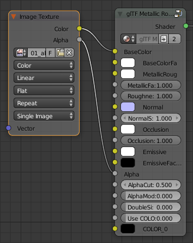
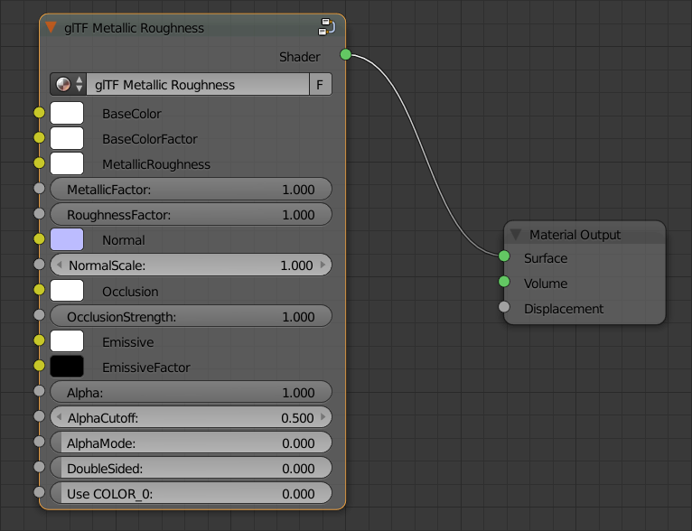
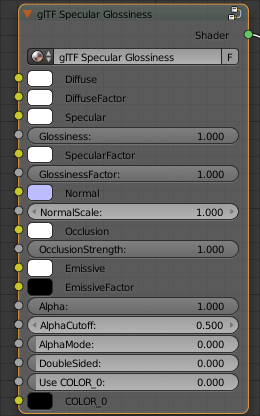
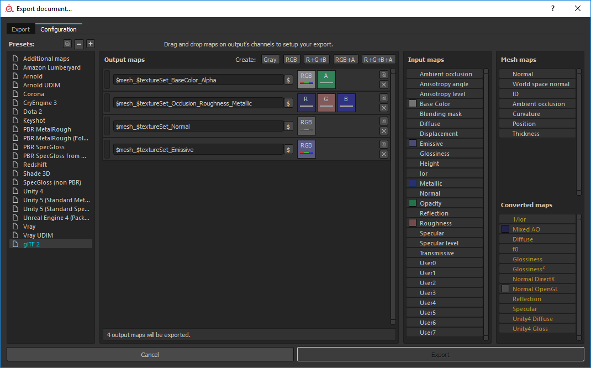

User Documentation
------------------

### Materials

### PBR Materials
At point of writing, the PBR materials are simulated with Cycles using a specific node tree encapsulated in a node group.
Two node groups are provided, one for the metallic roughness and one for the specular glossiness workflow.

Even possible in the Cycles node editor, specific requirements have to be fulfilled, that all parameters are exported to the glTF 2.0 file format successfully:  

- If a parameter is marked as 'Node group only', the parameter has to be changed in the node group. Any input by a node is ignored.  
- If a parameter is marked as 'Texture only', the parameter in the node group contains the default value. Changing this value is ignored. Only an 'Image Texture' input link is accepted.
- If a parameter is marked as 'Attribute only', the parameter in the node group contains the default value. Changing this value is ignored. Only an 'Attribute' input link is accepted.

All PBR materials share the same input parameters, which are listed in the following table:

|Material parameter export   |Node group only|Texture only|Attribute only|Comments                                        |
|----------------------------|:-------------:|:----------:|:------------:|------------------------------------------------|
|Normal texture              |               |X           |              |                                                |
|Normal strength             |X              |            |              |                                                |
|Normal texture coordinate   |               |            |              |'UV' from 'UV MAP' to 'Vector'                  |
|Occlusion texture           |               |X           |              |                                                |
|Occlusion strength          |X              |            |              |                                                |
|Occlusion texture coordinate|               |            |              |'UV' from 'UV MAP' to 'Vector'                  |
|Emissive texture            |               |X           |              |                                                |
|Emissive factor             |X              |            |              |                                                |
|Emissive texture coordinate |               |            |              |'UV' from 'UV MAP' to 'Vector'                  |
|Alpha texture channel       |X              |            |              |                                                |
|Alpha cutoff                |X              |            |              |                                                |
|Alpha mode                  |X              |            |              |                                                |
|Double sided                |X              |            |              |                                                |
|COLOR_0                     |               |            |X             |'Name' from 'Attribute' to first 'Vertex Colors'|

##### Alpha

By default, the alpha mode is 'OPAQUE' and set to 'BLEND', if 
- the BaseColorFactor or DiffuseFactor alpha value is less than 1.0  
- the Alpha channel from the BaseColor or Diffuse image texture is connected.  

Please note, that separate alpha maps are currently not specified in glTF 2.0 and so not working.
The alpha channel has to be linked from the above defined image textures. Following picture shows the correct and simple usage for the glTF Metallic Roughness node:

To use 'MASK' for blending, the AlphaMode has to be set from 0.0 to 1.0. In this case, as specified by glTF 2.0, the AlphaCutoff value is used and exported.

#### PBR Metallic Roughness

#### PBR Specular Glossiness

The specular glossiness material is not part of core glTF 2.0. The material is defined by the extension `KHR_materials_pbrSpecularGlossiness`.

#### CMN Blinn-Phong

The common Blinn-Phong material is not part of core glTF 2.0. The material is defined by the extension `KHR_materials_cmnBlinnPhong`.
A valid glTF 2.0 file can contain no materials. To avoid an unwanted export of this material type, the option for this material has explicitly be enabled. This common material is not dependent on any node group, as the materials from `Blender Render` are used. As the Blender material has more settings and options than defined in the common Blinn-Phong material, only the following parameters are exported:

TODO: List of exported textures and parameters.

### External Tools

The following section describes several tools, how they can optimal be used with the Blender glTF 2.0 exporter. 

#### Substance Painter
[Substance Painter](https://www.allegorithmic.com/products/substance-painter) is a 3D painting software allowing you to texture, render and share your work.  
At point of writing, the exporter of Substance Painter does not have a preset for glTF 2.0. However, this can be easily configured:  

Important is the order of `occlusion`: red channel, `roughness`: green chanel, `metallic`: blue channel. Even the glTF 2.0 property is named `metallicRoughnessTexture`, the above channel order assignment is the only valid one.

Furthermore, please make sure, that the `normal` is exported for `OpenGL`. Even your render is using a different graphics API, this is the only valid one.
