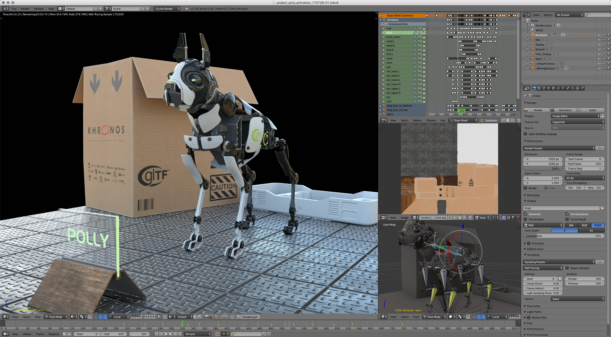

Project 'Polly'
---------------

Project 'Polly' was produced to test the glTF 2.0 exporter.
It contains almost all new glTF 2.0 features like:  

- Metallic Roughness PBR Materials
- Node, Morph Target and Skinning animations
- Blending and Masking
- Double sided materials

