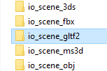
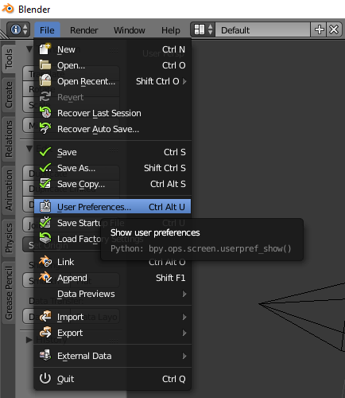
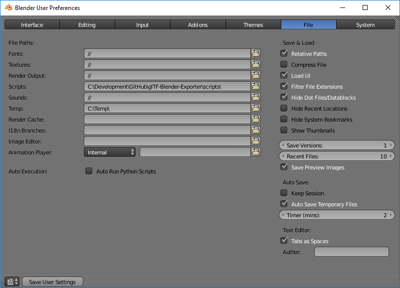
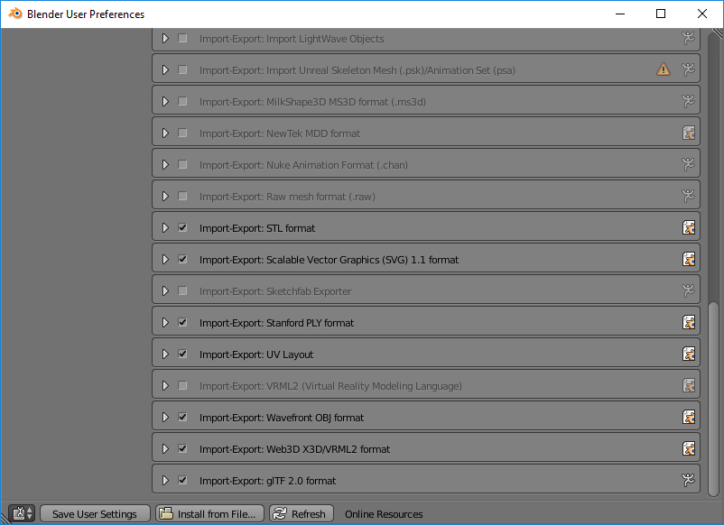

# Scripts

There are two methods of installing and enabling the glTF 2.0 Blender exporter. In either case, you must first [download the exporter](https://github.com/KhronosGroup/glTF-Blender-Exporter/archive/master.zip) and unzip it.

## Option 1: Copy into scripts/addons

After extracting the ZIP, copy `scripts/addons/io_scene_gltf2` to the `scripts/addons` folder of your Blender installation.

Next, [enable the exporter](#enable-the-exporter).

## Option 2: Configure user scripts directory

After downloading the exporter, open the `User Preferences...` dialog in Blender:

  

Go to the `File` tab and set the `Scripts` directory to the `scripts` folder from the downloaded ZIP:

  

An advantage of this option is that changes to the exporter are automatically visible applied in Blender. However, the `Scripts` folder is no longer available for other extensions.

After installing, you must enable the exporter.

## Enable the exporter

You must also enable the glTF 2.0 exporter under the `Add-ons` tab. If you have another glTF 2.0 exporter installed, only one may be enabled at a time.

  
